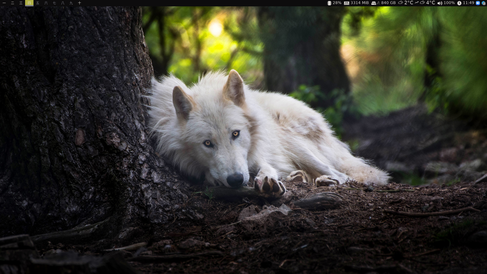
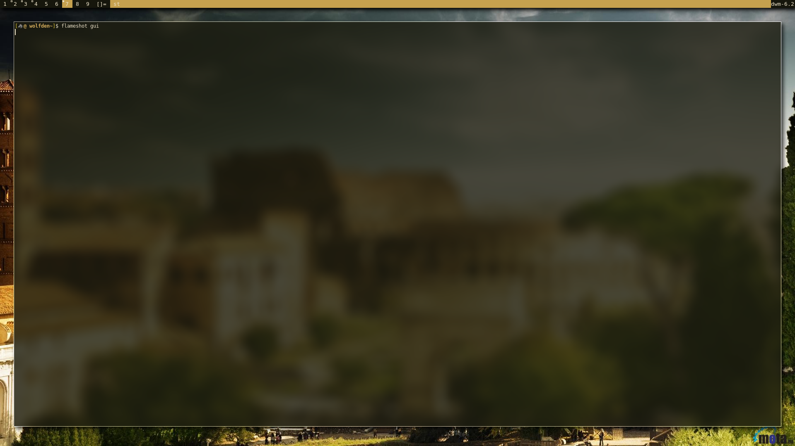
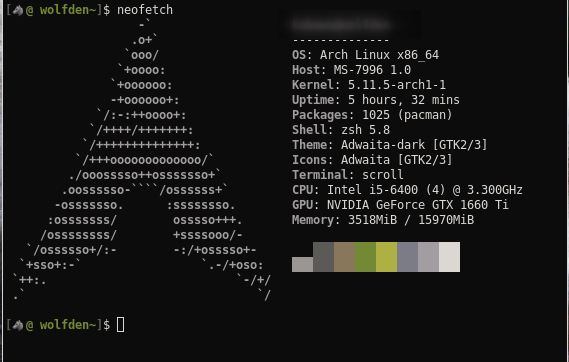

# My dotfiles and configs

XINITRC `xsetroot` set pl keys, turn off screensaver 

Ex. of blur and dwm variant (DWM with: focus on click, gaps, rotate)

# Browser

`https://github.com/wine/wal-start`
fork of this startpage 
Copy mozilla.cfg to /usr/lib/firefox/
Copy local-settings.js to /usr/lib/firefox/defaults/pref/

I'm testing librewolf at the moment, but my main browser is firefox

`firefox`

`librewolf` https://librewolf-community.gitlab.io/

Extensions:
bitwarden
ClearURLs
decentraleyes
ff2mpv
frankerfacez
pywalfox `https://github.com/frewacom/pywalfox`
search by image
stylus
unhook - remove yt recommendations
universal bypass
violentmonkey
sponsorblock
tabliss

# Dependences

(Only for DWM delete last line from template)
 `/usr/lib/pythonX.y/site-packages/pywal/templates/colors-wal-dwm.h`

 Pywal https://github.com/dylanaraps/pywal
 
 Doas `doas`
 
 Discord `https://github.com/FilipLitwora/pywal-discord`
 `https://github.com/BetterDiscord/Installer/releases/download/v1.0.0-beta/BetterDiscord-Linux.AppImage`
 
 Neovim `neovim` vimplug https://www.chrisatmachine.com/Neovim/01-vim-plug/
 
 Ranger `ranger` (`ueberzug` for image display in st) `sxiv` for images management
 
 Zsh 
 
 slstatus

 Dmenu https://github.com/LukeSmithxyz/dmenu
 
 Dwm patched `base-devel libX11-devel libXft-devel libXinerama-devel`
  
  `libxft-bgra`   `make`
  
 Bspwm `bspwm` `sxhkd`
 
 Polybar `font-awesome5` `weather icons` `material icons` any japanese font for numbers change it in config 
 
 https://github.com/kamek-pf/polybar-forecast
 
 St https://github.com/lukesmithxyz/st
 
 emoji `libxft-bgra` `fontconfig`
 
 
 
  
 
  
